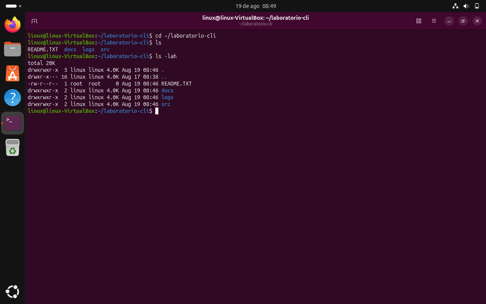

# Laboratorio CLI — Permisos de archivos y carpetas

Práctica de uso del comando `ls -lah` para listar permisos de archivos y carpetas dentro de `~/laboratorio-cli`, y su conversión a notación numérica (octal).

## Captura de pantalla

## Tabla de permisos

| Archivo/Carpeta | Permisos simbólicos | Permisos numéricos |
|---|---|---|
| src | rwxrwxr-x | 775 |
| logs | rwxrwxr-x | 775 |
| docs | rwxrwxr-x | 775 |
| README.TXT | -rw-r--r-- | 644 |
| .. | drwxr-x--- | 750 |
| . | drwxrwxr-x | 775 |

## Repositorio en GitHub

🔗 [LINUX3C/01-ejercicio](https://github.com/cnoe-web/LINUX3C/tree/main/01-ejercicio)
